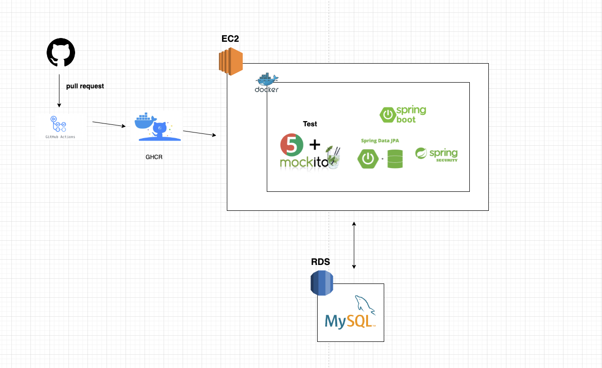
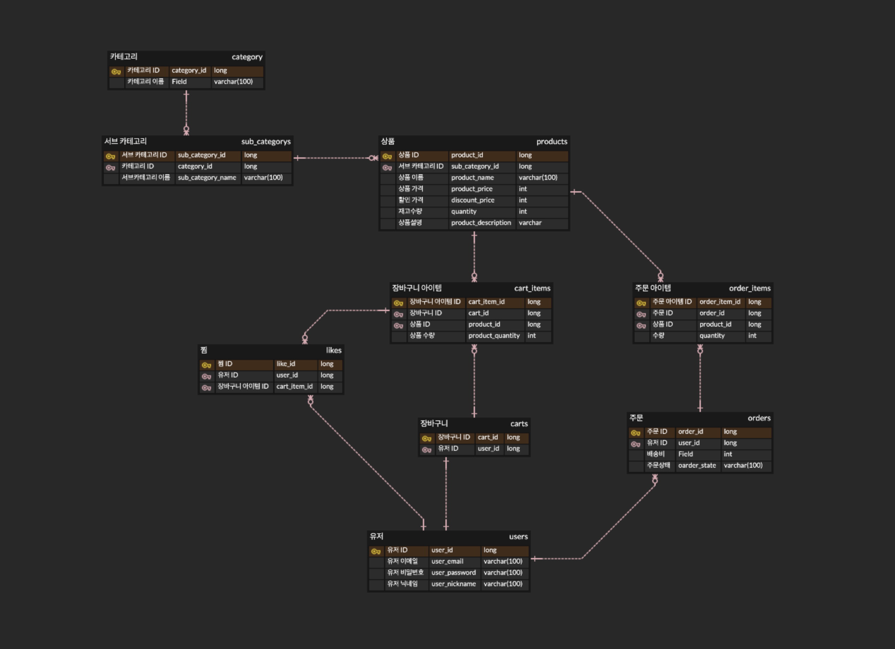

## B-market
**B마켓** 을 모티브로 한 프로젝트 입니다

 

### 기술스택
> Java 11, Spring Boot 2.7., Spring Securuty, Spring Data JPA, Gradle, Junit5, mokito, Docker, MySql, RDS,

 

### 프로젝트 구조

 

### 구현사항
##### **카테고리, 세부 카테고리**
- 카테고리 리스트 조회
- 세부 카테고리 리스트 조회

##### **상품**
- 상품 리스트 조회
- 상품 상세 정보 조회
- 상품 정렬
- 인기 상품 리스트 조회
- 최대 할인 상품 리스트

##### **장바구니**
- 장바구니 리스트 조회
- 장바구니에 상품 아이템 추가
- 장바구니 상품 삭제
- 장바구니에서 상품 수량 업데이트

##### **주문**
- 주문 생성
- 주문 취소
- 주문 내역 리스트 조회

##### **찜하기**
- 찜하기 추가
- 찜하기 삭제
- 찜한 목록 리스트
##### **유저**
- 회원가입
- 로그인
- 유저정보 조회

 

### ERD

